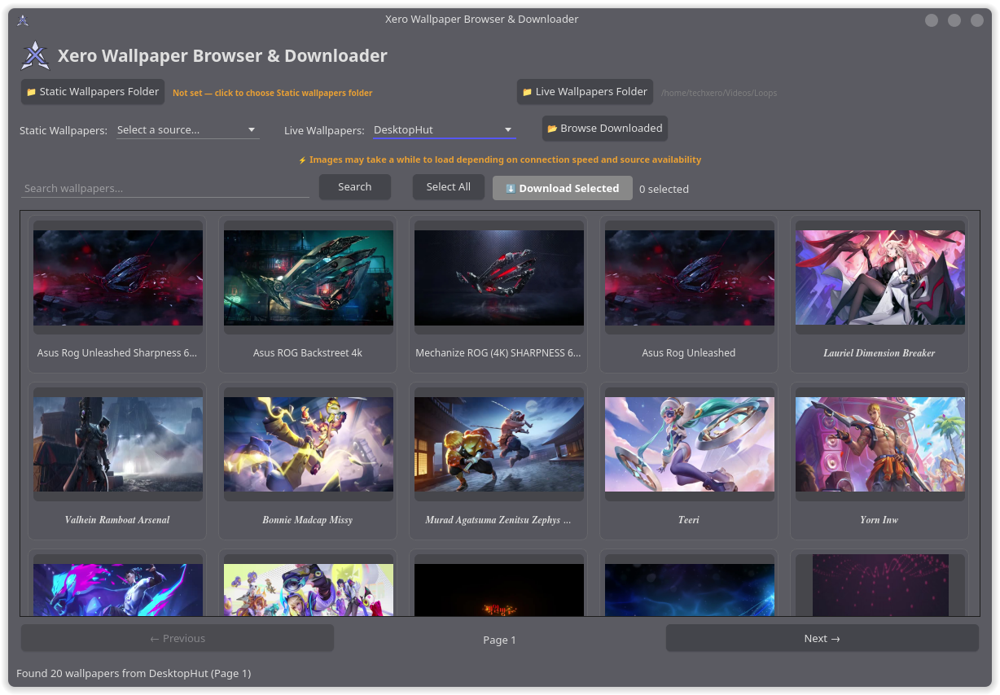

<p align="center">
  
</p>

<h1 align="center">Xero Wallpaper Browser & Downloader</h1>

<p align="center">
  <strong>Browse, preview and download wallpapers & live wallpapers from multiple online sources — all from one app.</strong>
</p>

<p align="center">
  
  
  
  
</p>

<p align="center">



</p>

---

## Features

### Wallpaper Sources

**Static Wallpapers**
- [DuskLinux Dark](https://github.com/dusklinux/images/tree/main/dark) — Curated dark wallpaper collection via GitHub API
- [Wallhaven](https://wallhaven.cc) — Massive wallpaper library with API search
- [4K Wallpapers](https://4kwallpapers.com) — High-resolution wallpapers up to 8K, auto-picks highest resolution

**Live Wallpapers**
- [MoeWalls](https://moewalls.com) — Animated/video wallpapers
- [MotionBGs](https://motionbgs.com) — Live desktop backgrounds with 4K/HD download options
- [DesktopHut](https://www.desktophut.com) — Animated wallpaper collection

### Browsing & Selection

- Thumbnail grid with lazy-loading and disk caching
- Search across all sources
- Pagination support
- Click to select, **Ctrl+Click** to toggle, **Shift+Click** for range select
- Select All / Deselect All
- Double-click to preview full resolution

### Downloading

- Separate download folders for Static and Live wallpapers
- Batch download with progress bar
- Auto-resolves highest quality download links
- Smart file naming with duplicate avoidance

### Local Browser

- **Browse Downloaded** button opens a tabbed dialog (Static / Live tabs)
- Video thumbnails extracted from actual video frames (via OpenCV) with play button overlay
- Image thumbnails loaded natively

### In-App Preview

- **Images** — Full-resolution preview with **Set as Wallpaper** button
- **Videos** — Embedded video player with play/pause, stop, loop, volume controls — no external tools needed

### Set as Wallpaper

Auto-detects your desktop environment and applies the wallpaper:

| Desktop | Method |
|---------|--------|
| KDE Plasma | `plasma-apply-wallpaperimage` |
| GNOME | `gsettings` (picture-uri-dark) |
| XFCE | `xfconf-query` |
| MATE | `gsettings` (org.mate) |
| Cinnamon | `gsettings` (org.cinnamon) |
| Hyprland / Sway | `swaybg` |
| Fallback | `feh` or `nitrogen` |

> Live wallpapers must be set using your preferred tool (e.g. Komorebi, Hidamari, xwinwrap, mpvpaper).

### UI

- Uses system theme — looks native on any DE
- Glowing orange status notes and guidance text
- Bold instructional welcome screen for first-time users
- Responsive grid layout that adapts to window size

---

## Usage From Source

**Dependencies:**

```bash
sudo pacman -S python-pyqt6 python-requests python-beautifulsoup4 python-pillow python-opencv python-numpy qt6-multimedia qt6-multimedia-gstreamer gst-plugins-good gst-plugins-bad gst-libav
```

**Run:**

```bash
python xero_wallpaper_browser.py
```

---

## Configuration

Settings are stored at `~/.config/xero-wallpaper-browser/config.json`:

| Key | Description |
|-----|-------------|
| `static_download_dir` | Download folder for static wallpapers |
| `live_download_dir` | Download folder for live wallpapers |

Thumbnail cache is stored at `~/.cache/xero-wallpaper-browser/`.

---

## Version History

### v1.0.0 — Initial Release

- **Core app** — PyQt6 GUI with system theme integration
- **6 wallpaper sources** — 3 static (DuskLinux, Wallhaven, 4K Wallpapers) + 3 live (MoeWalls, MotionBGs, DesktopHut)
- **Thumbnail grid** — Lazy-loaded with disk cache, responsive layout
- **Multi-select & batch download** — Click, Ctrl+Click, Shift+Click, Select All
- **Separate download folders** — Independent paths for static and live wallpapers
- **Search & pagination** — Across all sources
- **Local browser** — Tabbed dialog to browse downloaded wallpapers
- **Video thumbnails** — Extracted from video frames via OpenCV with play overlay
- **In-app video player** — Embedded QMediaPlayer with full transport controls (play/pause, stop, loop, volume)
- **In-app image preview** — Full-resolution with Set as Wallpaper
- **Set as wallpaper** — Auto-detects DE (KDE, GNOME, XFCE, MATE, Cinnamon, Hyprland/Sway, feh, nitrogen)
- **Arch Linux packaging** — PKGBUILD with .desktop entry and icon

---

## License

This project is licensed under the [GPL-3.0](https://www.gnu.org/licenses/gpl-3.0.html) License.

---

<p align="center">
  Made with care for the <a href="https://xerolinux.xyz">XeroLinux</a> community
</p>
